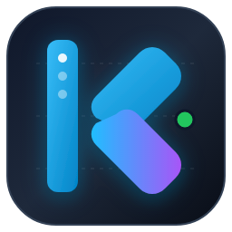

<div align="center">
  

  # yaKaggle
  ### Yet Another Kaggle Extension for Visual Studio Code

  [](https://github.com/rnascunha/yaKaggle/actions/workflows/ci.yml)
  [](https://marketplace.visualstudio.com/items?itemName=rnascunha.yakaggle)
  [](https://opensource.org/licenses/MIT)
  [](https://nodejs.org/)
  [](https://github.com/rnascunha/yaKaggle/issues)
  [](https://github.com/rnascunha/yaKaggle/stargazers)

  <p align="center">
    Seamlessly interact with Kaggle Kernels, Datasets, and Competitions directly from inside VS Code using the official Kaggle CLI.
  </p>
</div>

---

> ⚠️ **Development Notice:** **yaKaggle** is currently under active development. While core workflows are functional, it has not yet been comprehensively tested across every OS distribution, shell, and virtual environment setup. If you run into unexpected behavior, please file a report on [GitHub Issues](https://github.com/rnascunha/yaKaggle/issues).

---

## Overview

**yaKaggle** bridges the gap between your local development environment and Kaggle\x27s cloud platform. Instead of constantly switching between browser tabs, terminal commands, and editors, yaKaggle surfaces Kaggle Kernels, Datasets, and Competitions into structured, non-blocking VS Code TreeViews, output channels, and status bar monitors.

## Kaggle API Token & Authentication Setup

To use yaKaggle, you need an active Kaggle account and an official API token (`kaggle.json`).

### 1. Generating Your Token on Kaggle
1. Sign in to your account at [kaggle.com](https://www.kaggle.com).
2. Click on your profile picture in the top-right corner and select **Settings** (or navigate to `https://www.kaggle.com/settings`).
3. Scroll down to the **API** section.
4. Click **Create New Token**. This downloads `kaggle.json`:
```json
{
  "username": "your_kaggle_username",
  "key": "your_api_key_string"
}
```

### 2. Placing the Token on Your Machine
Move `kaggle.json` into the default directory for your operating system:

* **Linux / macOS:**
```bash
mkdir -p ~/.kaggle
mv ~/Downloads/kaggle.json ~/.kaggle/
chmod 600 ~/.kaggle/kaggle.json
```

* **Windows:**
Move the file to:
`C:\\Users\\<YourUsername>\\.kaggle\\kaggle.json`

### 3. Verification Inside yaKaggle
Open the Command Palette (`Ctrl+Shift+P` / `Cmd+Shift+P`) and run:
* **`yaKaggle: Verify Credentials`** to confirm the token is detected.
* If your token is stored elsewhere, set `yakaggle.kaggleConfigDir` in VS Code settings.

---

## Features

### 🧠 Kernels & Notebooks
* **Local Workspace Detection**: Discovers `kernel-metadata.json` files and pairs them with scripts/notebooks.
* **Missing File Alerts**: Inline warnings alert you if a file pointed to by metadata is missing.
* **Schema Validation & Autocomplete**: Complete JSON schema validation with autocomplete and linting.
* **Remote Notebook Browsing**: View your remote kernels with pagination.
* **Pull to In-Memory Buffer**: Preview remote notebooks directly into untitled VS Code editor tabs.
* **One-Click Kernel Push**: Deploy local changes to Kaggle with background progress reporting.
* **Live Status Monitoring**: Monitors active/queued jobs, auto-updates state, and streams execution logs.
* **Artifact Extraction**: Download all generated output files, weights, and logs.

### 💾 Datasets
* **Local Dataset Explorer**: Discovers local `dataset-metadata.json` configurations.
* **Dataset Initialization Wizard**: Scaffolds new dataset folders and boilerplate metadata.
* **Remote Dataset Management**: Lists hosted datasets with complete names and size info.
* **Lazy File Browsing**: Inspect remote files and folder hierarchies on demand.
* **Flexible Downloading**: Download complete datasets as intact `.zip` archives or grab single files.

### 🏆 Competitions
* **Filtered Views**: Dedicated sections for "My Active Competitions" and "Recent & Featured".
* **Visual Identifiers**: Status icons for entered, active, and closed competitions.
* **Detailed Tooltips**: Hover for prize pool, team counts, category, and deadline countdowns.
* **Leaderboard Inspector**: View top standings and your team rank in a formatted log table.
* **Data Download**: Download competition files directly into your workspace.

## Getting Started

### Prerequisites
1. **Node.js** (v20.x or higher) and **npm**.
2. **Kaggle CLI** installed in your environment:
```bash
pip install kaggle
```
3. A valid `kaggle.json` configured on your system.

### Clone and Installation
1. Clone the repository:
```bash
git clone https://github.com/rnascunha/yaKaggle.git
cd yaKaggle
```

*(Or set the remote in an existing folder:)*
```bash
git remote add origin https://github.com/rnascunha/yaKaggle.git
```

2. Install dependencies:
```bash
npm install
```

3. Compile TypeScript:
```bash
npm run compile
```

---

## Running and Debugging Locally

1. Open the project in VS Code (`code .`).
2. Press **`F5`** to launch the Extension Development Host.
3. Click on the **yaKaggle** cloud icon in the Activity Bar.

---

## Running Tests

* **Unit Tests** (fast, mock runtime):
```bash
npm run test:unit
```
* **VS Code Integration Suite** (headless Electron instance):
```bash
npm test
```

---

## Extension Settings

* `yakaggle.kagglePath`: Custom path to `kaggle` CLI binary or venv.
* `yakaggle.kaggleConfigDir`: Custom directory path containing `kaggle.json`.

---

## Feedback, Bugs & Contributing

* **Found a bug?** Submit reproduction steps and OS details on [GitHub Issues](https://github.com/rnascunha/yaKaggle/issues).
* **Have an idea?** Open a feature request or discussion.
* **Want to contribute?** Fork the repo, create a branch (`git checkout -b feature/my-feature`), and open a Pull Request.

---

## License

Distributed under the **MIT License**. See [`LICENSE`](LICENSE) for details.
